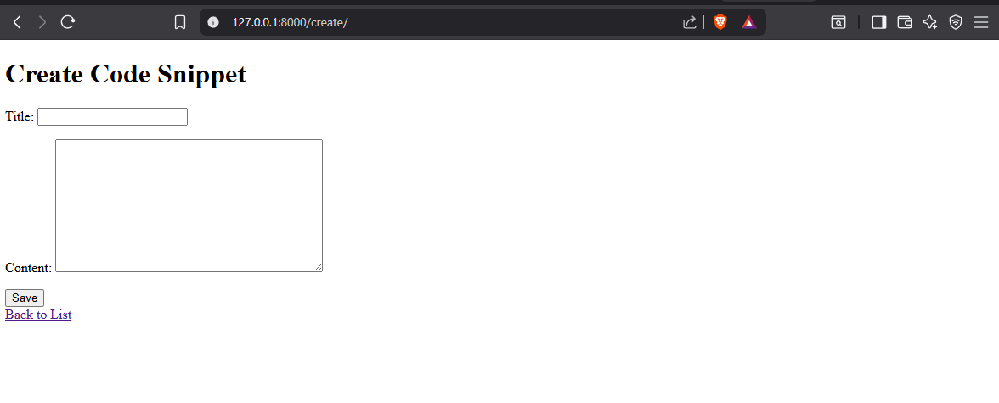
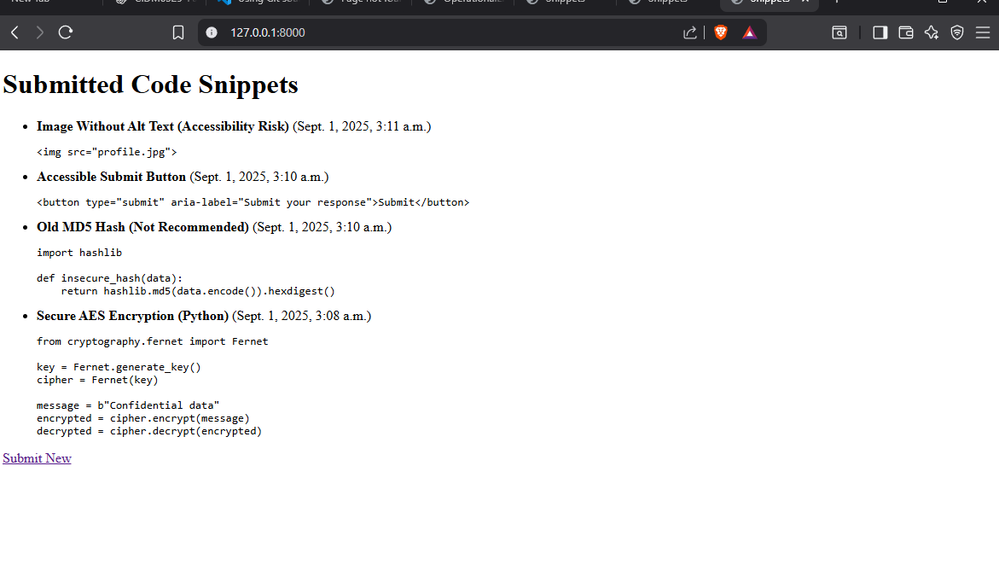

# Django CRUD MiniLab – Hallucination Checker

## Project Overview

This Django mini-app demonstrates a secure CRUD pattern for managing AI-generated code snippets that may contain hallucination risks. It supports:

- Creating a code snippet
- Viewing all submitted snippets
- Lays groundwork for later annotations and validations

---

## 🛠️ Setup & Scaffold

```bash
django-admin startproject hallucination_checker
cd hallucination_checker
python manage.py startapp hallucination_app
````

Registered `hallucination_app` in `INSTALLED_APPS`.

---

## 📌 Model

```python
# hallucination_app/models.py
from django.db import models

class CodeSnippet(models.Model):
    title = models.CharField(max_length=100)
    content = models.TextField()
    created_at = models.DateTimeField(auto_now_add=True)

    def __str__(self):
        return self.title
```

---

## 🌐 URLs + Views (Create + Read)

```python
# hallucination_app/views.py
from django.shortcuts import render, redirect
from .models import CodeSnippet
from .forms import CodeSnippetForm

def create_snippet(request):
    if request.method == 'POST':
        form = CodeSnippetForm(request.POST)
        if form.is_valid():
            form.save()
            return redirect('list_snippets')
    else:
        form = CodeSnippetForm()
    return render(request, 'hallucination_app/create_snippet.html', {'form': form})

def list_snippets(request):
    snippets = CodeSnippet.objects.all()
    return render(request, 'hallucination_app/list_snippets.html', {'snippets': snippets})
```

---

## 🔄 Transaction & Invariants

Although simple, this app adheres to Django-first principles:

* Models are the **single source of truth**
* Views are kept thin
* Validation can be extended via `Model.clean()` or custom `Managers`
* In production, `transaction.atomic()` can wrap save actions for safety in concurrent access

---

## 📸 Screenshots




---

## 💡 Reflection

This CRUD lab helped reinforce how Django naturally encourages separation of concerns. For larger-scale AI code validators, the same foundation could be extended with:

* `transaction.atomic()` for batch validations
* `select_for_update()` to prevent race conditions in status updates
* Form/Model validations for schema and risk rules
* API views for frontend decoupling

---

## 🔗 Repo Links

* [View full commit history here](https://github.com/your-username/repo-name/commit/xxxxx)
* [View `models.py`](https://github.com/your-username/repo-name/blob/main/Module1Assignment/src/hallucination_checker/hallucination_app/models.py)


