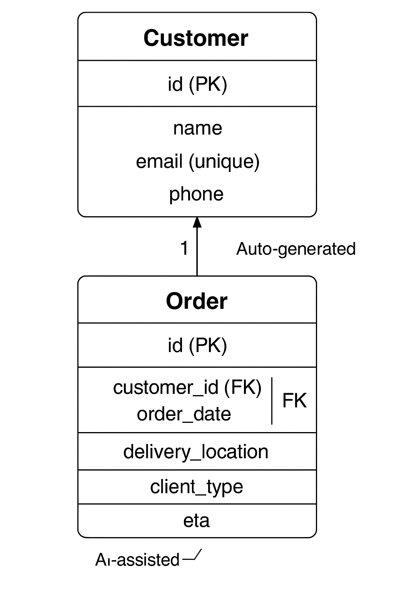

#  Module 3 – CIDM 6325: Form Validation + Multi-Model Design

**Author:** Mafruha Chowdhury
**Course:** CIDM 6325 – Electronic Commerce (Fall 2025)
**Focus:** AI-assisted form validation, multi-model design, and accessibility

---

## 📚 Table of Contents

1. [Overview](#overview)
2. [Additional Documentation](#additional-documentation)
3. [Part A: Forms & Validation](#part-a-forms--validation)
4. [Part B: Multi-Model Design](#part-b-multi-model-design)
5. [CRUD Verification](#crud-verification)
6. [Key Files](#key-files)
7. [AI Use Summary](#ai-use-summary)
8. [Ethical & Accessibility Reflection](#ethical--accessibility-reflection)
9. [Schema Diagram](#schema-diagram)
10. [Requirements](#requirements)
11. [How to Run This App](#how-to-run-this-app)
12. [Notes](#notes)

---

##  Overview

This module extends the logistics delivery app built in Module 2 by implementing:

* Custom form validation (`OrderForm`)
* Auto-generated `order_id` (e.g., `ORD-1A2B3C`)
* ETA estimation using mock AI logic
* A new `Customer` model (One-to-Many with Orders)
* Bootstrap-styled, accessible forms
* HTMX-compatible form structure
* Admin interface for both models

---

## 📄 Additional Documentation

| Document                                     | Description                                                          |
| -------------------------------------------- | -------------------------------------------------------------------- |
| [`docs/PARTE.md`](docs/PARTE.md)             | Critique of DjangoVMS Journey and instructor’s GitHub methodology.   |
| [`docs/PEER_REVIEW.md`](docs/PEER_REVIEW.md) | Peer review assessing another student's form design and model logic. |
---

## ✅ Part A: Forms & Validation

### 🧪 Validation Logic

Implemented in `forms.py`:

* `clean_order_date`: Prevents orders dated in the past
* `clean()`: Prevents client type from being embedded in delivery location
* `order_id`: Auto-generated in `Order.save()` method
* User-friendly error messages using Bootstrap + ARIA
* WCAG 2.2–aligned form layout

---

## 🧬 Part B: Multi-Model Design

* `Customer` model added with `One-to-Many` relationship
* Linked via foreign key in the `Order` model
* Fully functional in admin and form
* Tested with real CRUD scenarios

---

## 🧪 CRUD Verification

| Scenario                             | Result        |
| ------------------------------------ | ------------- |
| Create Order via Form                | ✅ Works       |
| View Orders List                     | ✅ Works       |
| Update Order via Admin               | ✅ Works       |
| Delete Order via Admin               | ✅ Works       |
| Validation for Past Date             | ✅ Error shown |
| Validation for Duplicate Client Type | ✅ Error shown |
| Required Field: Customer             | ✅ Error shown |

---

## 📁 Key Files

* `models.py`: Defines `Order`, `Customer`
* `forms.py`: Custom `OrderForm` with validations
* `views.py`: Full CRUD support
* `order_form.html`: Bootstrap + accessible
* `AI_LOG.md`: Prompt log and design decisions
* `README.md`: This documentation

---

## 🤖 AI Use Summary

AI assistance included:

* Auto-ID generation logic (`ORD-XXXXXX`)
* ETA field mock generation
* Validation rule suggestions
* UX guidance for error display and form layout
* Accessibility checks (ARIA roles, WCAG alignment)

---

## 🧐 Ethical & Accessibility Reflection

This module emphasized both technical correctness and responsible design:

* All validation messages were tested for clarity and user dignity.
* ARIA roles and label-input linking were used for screen reader compatibility.
* Auto-generated IDs reduced user input risk.
* Every AI-suggested code block was manually reviewed and adjusted for business fit, usability, and ethical clarity.

---

## 📊 Schema Diagram



---

## 📦 Requirements

```txt
Django>=4.2,<5.0
django-htmx>=1.15.0
```

> Run `pip install -r requirements.txt` to install dependencies.

---

## 🚀 How to Run This App

```bash
# Create virtual environment
python -m venv venv
venv\Scripts\activate       # On Windows

# Install dependencies
pip install -r requirements.txt

# Run migrations and server
python manage.py migrate
python manage.py runserver
```

---

## 📝 Notes

* All features tested manually
* Forms validated on both client and server side
* Admin interface supports both models
* HTMX-compatible for future interactive enhancements
